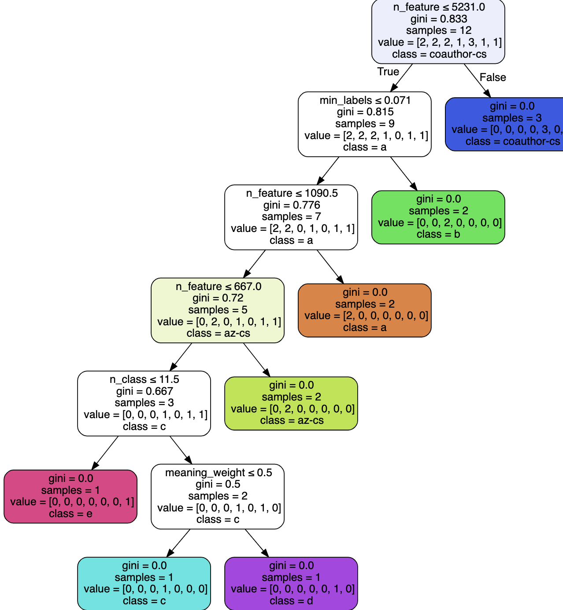

[](https://github.com/Unkrible/AutoGraph2020/blob/master/LICENSE)

AutoGraph
======================================


## Contents

- ingestion/: The code and libraries used on Codalab to run your submmission.

- scoring/: The code and libraries used on Codalab to score your submmission.

- code_submission/: An example of code submission you can use as template.

- data/: Some sample data to test your code before you submit it.
- Meta.model: A decision tree for adaptive configuration of hyperparameters
- [Extra Dataset used in competition](https://github.com/mecthew/Graph-Dataset)


## Local development and testing
1. To make your own submission to AutoGraph challenge, you need to modify the
file `model.py` in `code_submission/`, which implements your algorithm.
2. Test the algorithm on your local computer using Docker,
in the exact same environment as on the CodaLab challenge platform. Advanced
users can also run local test without Docker, if they install all the required
packages.
3. If you are new to docker, install docker from https://docs.docker.com/get-started/.
Then, at the shell, run:
```
cd path/to/autograph_starting_kit/
docker run --gpus=0 -it --rm -v "$(pwd):/app/autograph" -w /app/autograph nehzux/kddcup2020:v2
```
The option `-v "$(pwd):/app/autograph"` mounts current directory
(`autograph_starting_kit/`) as `/app/autograph`. If you want to mount other
directories on your disk, please replace `$(pwd)` by your own directory.

The Docker image
```
nehzux/kddcup2020:v2
```

4. You will then be able to run the `ingestion program` (to produce predictions)
and the `scoring program` (to evaluate your predictions) on toy sample data.
In the AutoGraph challenge, both two programs will run in parallel to give
feedback. So we provide a Python script to simulate this behavior. To test locally, run:
```
python run_local_test.py
```
If the program exits without any errors, you can find the final score from the terminal's stdout of your solution.
Also you can view the score by opening the `scoring_output/scores.txt`.

The full usage is
```
python run_local_test.py --dataset_dir=./data/demo --code_dir=./code_submission
```
You can change the argument `dataset_dir` to other datasets (e.g. the two
practice datasets we provide). On the other hand, you can also modify the directory containing your other sample code.

5. You can directly use `sh ./meta_run.sh log_folder run_times [dataset1, dataset2, ...]` to run our programs in batch.


##  Contributor


- Zhuoer Xu, NJU, [xuzhuoer.rex@gmail.com](mailto:xuzhuoer.rex@gmail.com)

- Feng Cheng, NJU, [hazzacheng@gmail.com](mailto:hazzacheng@gmail.com)
- Wenjie Wang, NJU, [wjwangpt@gmail.com](mailto:wjwangpt@gmail.com)
- Mengchuan Qiu, NJU, [mecthew.qiu@gmail.com](mailto:mecthew.qiu@gmail.com)
